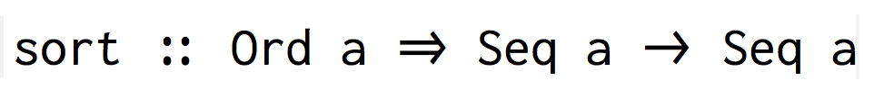

# Inconsolata-BB

This is the standard font Inconsolata, but with the brackets and delimiters instead replaced, stolen from Google's Roboto Mono. They're adapted for Inconsolata so they don't look out-of-place, and more importantly are a significant improvement upon the spacing, alignment, and style of the original (somewhat inconsistent, and crowded) Inconsolata brackets.

The changes allow for subjectively neater-looking, properly spaced code. An example can be seen below:

Original (example) | Modified (example)
-------------------|-------------------
|

And, more recently, ligatures (granted just stolen from Fira Code, but they still look great; all credit goes to [ToxicFrog](https://github.com/ToxicFrog) with [Ligaturizer](https://github.com/ToxicFrog/Ligaturizer))!

Note: I don't own Inconsolata! I only made a few changes to it. The font was created by Raph Levien, and released under the Open Font License. For more information about its birthplace, check [here](http://levien.com/type/myfonts/inconsolata.html).