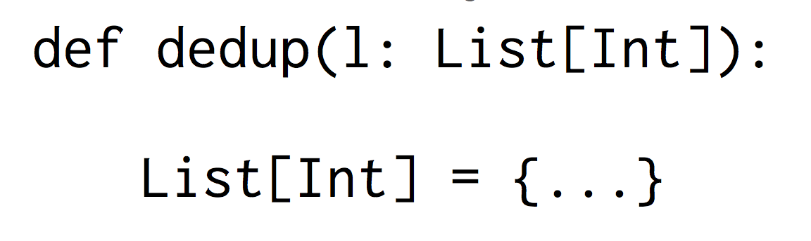
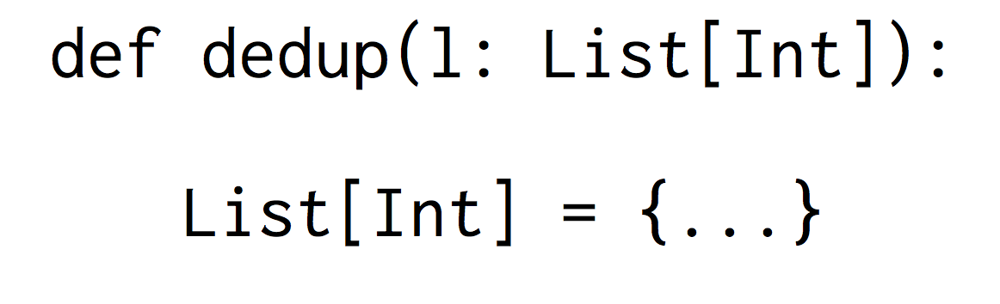

# Inconsolata-BB

Original (example) | Modified (example)
-------------------|-------------------
|

Note: I don't own Inconsolata! I only made a few changes to it. The font was created by Raph Levien, and released under the Open Font License. For more information about its birthplace, check [here](http://levien.com/type/myfonts/inconsolata.html).